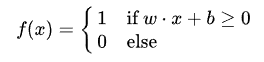

                 
## history   
O perceptron foi inventado em 1943 por Warren McCulloch e Walter Pitts. A primeira implementação de hardware foi a máquina Mark I Perceptron construída em 1957 por Frank Rosenblatt no Cornell Aeronautical Laboratory. Ele pode ser visto como o tipo mais simples de rede neural feedforward: um classificador linear.
1. Mark I Perceptron
   
    

      
      
    

   
2. Modelo teorico 
   
    

      
    

   

## definition
O perceptron é um classificador binário que mapeia sua entrada x em (um vetor de valor real) para um valor de saída f(x) (uma valor binário simples) através da matriz.
    

      
    

Onde w é um vetor de peso real e w⋅x é o produto escalar (que computa uma soma com pesos) e é o viés (do inglês "bias"), um termo constante que não depende de qualquer valor de entrada.
# Função de Soma e sua Integração com a Função de Ativação

  

No contexto de redes neurais, a **função de soma** é responsável por calcular a combinação linear das entradas, levando em conta seus pesos. Esse cálculo é fundamental para determinar a saída do neurônio, que, em seguida, passa pela função de ativação para produzir o resultado final.

## O que é a Função de Soma?

A **função de soma** realiza uma operação matemática simples, mas crucial, para o funcionamento do perceptron (ou qualquer outro modelo de rede neural). Ela é responsável por calcular a soma ponderada das entradas do modelo. A operação é a seguinte:

\[
z = w_1 x_1 + w_2 x_2 + ... + w_n x_n + b
\]

Onde:

- \( x_1, x_2, ..., x_n \) são as entradas (valores que o modelo recebe).
- \( w_1, w_2, ..., w_n \) são os **pesos** associados a cada entrada. Os pesos indicam a importância relativa de cada entrada no cálculo da soma.
- \( b \) é o **viés** (bias), um valor extra que permite ajustar a saída da soma sem depender das entradas.

Essa soma ponderada \( z \) é o valor que será usado na próxima etapa do processo, que é a **função de ativação**.

## Integração da Função de Soma com a Função de Ativação

Após a função de soma calcular o valor \( z \), esse valor é passado para a **função de ativação**, que decide qual será a saída do perceptron. A função de ativação transforma o valor \( z \) de uma maneira específica, dependendo do tipo de ativação utilizada.

Por exemplo:

- **Função de ativação degrau (step function)**: Retorna 1 ou 0 dependendo se a soma \( z \) ultrapassa um limiar.
- **Função sigmoide**: Converte a soma \( z \) para um valor entre 0 e 1, útil para representar probabilidades.
- **Função ReLU (Rectified Linear Unit)**: Se \( z \) for negativo, a saída será 0; se \( z \) for positivo, a saída será \( z \) (a própria soma).

Portanto, a função de soma serve como base para a função de ativação, fornecendo o valor que será ajustado pela função de ativação para gerar a saída final do perceptron.

## Resumo

A função de soma realiza a combinação ponderada das entradas e, em seguida, esse valor é passado pela função de ativação para gerar a saída do modelo. A função de soma lida com o processamento linear das entradas, enquanto a função de ativação permite que o perceptron lide com não linearidades, ajustando a saída de acordo com a transformação definida pela função escolhida.

# Função de Ativação no Perceptron

  

Uma **função de ativação** no perceptron é um componente matemático essencial utilizado para determinar a saída do modelo, dado um conjunto de entradas e um peso associado a cada uma dessas entradas.

## O que é uma função de ativação?

A função de ativação é aplicada ao valor somado das entradas multiplicadas pelos seus respectivos pesos. Ou seja, ela age sobre a **soma ponderada das entradas** e decide se o perceptron (ou qualquer outro neurônio artificial) "dispara" ou não uma resposta, transformando a soma ponderada em um valor útil para a rede neural.

## Como funciona a função de ativação?

Em um perceptron simples, o modelo realiza os seguintes passos:

1. **Entrada e ponderação**: Recebe as entradas \( x_1, x_2, ..., x_n \) e calcula uma soma ponderada:
   \[
   z = w_1 x_1 + w_2 x_2 + ... + w_n x_n + b
   \]
   onde \( w_i \) são os pesos das entradas e \( b \) é o viés.

2. **Aplicação da função de ativação**: A soma \( z \) é então passada por uma função de ativação, que gera a saída do perceptron.

## Para que serve a função de ativação?

1. **Introdução de não linearidade**: Sem a função de ativação, o perceptron seria uma simples combinação linear das entradas e pesos, limitando sua capacidade de aprender funções complexas. A função de ativação permite que a rede neural aprenda padrões não lineares, aumentando sua capacidade de modelar problemas mais complexos.

2. **Decisão de ativação ou não**: A função de ativação decide se o perceptron vai gerar uma resposta positiva ou negativa com base nas entradas.

## Tipos de funções de ativação:

- **Função degrau (step function)**: A saída é 1 ou 0, dependendo da soma das entradas.
  
- **Função sigmoide**: Gera uma saída contínua entre 0 e 1. Usada quando é necessário um valor probabilístico.
  
- **Função ReLU (Rectified Linear Unit)**: A saída é 0 para valores negativos e o valor de entrada para valores positivos. É muito utilizada em redes neurais profundas devido à sua eficiência computacional.

## Resumo

A função de ativação é fundamental para a inteligência do perceptron, permitindo que ele lide com dados complexos, transformando entradas lineares em saídas adequadas para uma tarefa específica. Ela ajuda o modelo a aprender e generalizar de maneira mais eficaz.

# Erro e Atualização dos Pesos no Perceptron

No treinamento de redes neurais, o objetivo é ajustar os pesos de modo que a rede aprenda a fazer previsões precisas. A **atualização dos pesos** ocorre com base no **erro** entre a saída prevista e a saída real desejada. Vamos explorar como o erro é calculado e como os pesos são ajustados.

## O que é o Erro?

O **erro** é a diferença entre a saída desejada (rótulo verdadeiro) e a saída calculada pelo perceptron (previsão feita). No contexto de um perceptron simples, o erro pode ser definido como:

\[
\text{erro} = \text{saida desejada} - \text{saida calculada}
\]

Esse erro serve como uma medida de quão bem ou mal o modelo está fazendo a previsão. Quanto maior o erro, mais os pesos precisam ser ajustados para melhorar a precisão.

### Exemplo de Cálculo do Erro

Suponha que a saída desejada seja \( y = 1 \) e a saída calculada seja \( \hat{y} = 0 \). O erro seria:

\[
\text{erro} = 1 - 0 = 1
\]

Este erro indica que a previsão do modelo precisa ser ajustada para se aproximar mais da resposta correta.

## Atualização dos Pesos

O objetivo do processo de treinamento é minimizar o erro. Para isso, utilizamos o algoritmo de **retropropagação** ou, no caso do perceptron simples, uma versão simplificada do processo, chamada **regra de atualização do perceptron**. A atualização dos pesos é feita com base no erro calculado, ajustando os pesos para reduzir o erro nas futuras previsões.

A fórmula para atualizar os pesos no perceptron é a seguinte:

\[
w_i = w_i + \Delta w_i
\]

Onde:

- \( w_i \) é o peso do \(i\)-ésimo atributo.
- \( \Delta w_i \) é o ajuste no peso, calculado como:
  
\[
\Delta w_i = \eta \cdot \text{erro} \cdot x_i
\]

Onde:
- \( \eta \) é a **taxa de aprendizado**, que controla a quantidade de ajuste aplicada aos pesos.
- \( \text{erro} \) é a diferença entre a saída desejada e a saída calculada.
- \( x_i \) é a entrada associada ao peso \( w_i \).

Portanto, o novo peso \( w_i \) é calculado com o ajuste \( \Delta w_i \), que depende da taxa de aprendizado, do erro e da entrada correspondente.

### Exemplo de Atualização dos Pesos

Suponha que temos a seguinte situação:

- \( w = 0.5 \)
- \( x = 1 \)
- \( \eta = 0.1 \)
- \( \text{erro} = 1 \)

O ajuste no peso seria:

\[
\Delta w = 0.1 \cdot 1 \cdot 1 = 0.1
\]

Assim, o novo peso seria:

\[
w_{\text{novo}} = 0.5 + 0.1 = 0.6
\]

### Processo Iterativo

Esse processo de cálculo do erro e atualização dos pesos é repetido para todas as entradas do conjunto de treinamento. Ao longo das iterações, os pesos vão sendo ajustados para minimizar o erro e melhorar a acurácia do modelo.

## Resumo

- O **erro** é a diferença entre a saída desejada e a saída calculada.
- A **atualização dos pesos** ajusta os pesos do perceptron com base no erro, utilizando a fórmula \( w_i = w_i + \eta \cdot \text{erro} \cdot x_i \).
- A **taxa de aprendizado** (\( \eta \)) controla a magnitude da atualização.
- O objetivo é reduzir o erro ao longo das iterações, ajustando os pesos até que o modelo consiga fazer previsões precisas.

Essa abordagem permite que o perceptron aprenda com os dados, ajustando-se para realizar classificações ou previsões corretas, com base no feedback fornecido pelo erro.

## types neural networks 

  

